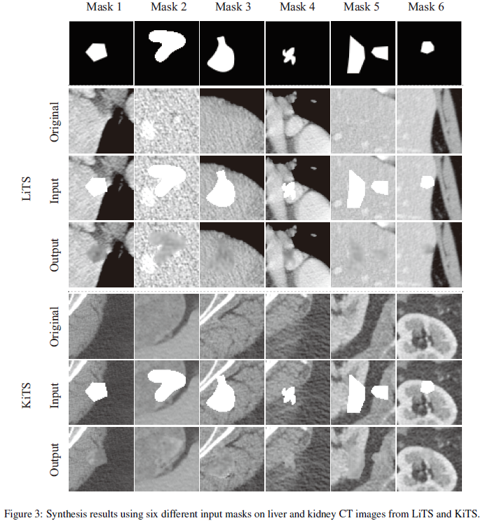
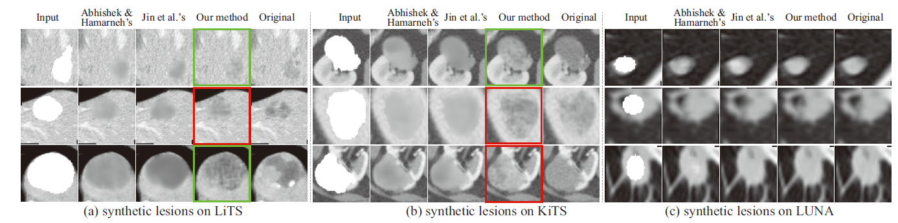
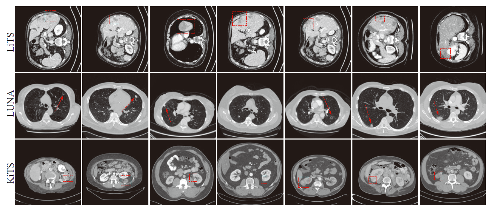

### FRGAN

**Free-form tumor synthesis in computed tomography images via richer generative adversarial network(https://doi.org/10.1016/j.asoc.2020.106881)** published in Knowledge-Based Systems

by [Qiangguo Jin](https://scholar.google.com/citations?user=USoKG48AAAAJ), [Hui Cui](https://scholars.latrobe.edu.au/display/lcui), [Changming Sun](https://vision-cdc.csiro.au/changming.sun/), [Zhaopeng Meng](http://cic.tju.edu.cn/info/1170/2451.htm), [Ran Su](http://www.escience.cn/people/suran/index.html).

### Example results 


- Synthesis results using six different input masks on liver and kidney CT images from LiTS and KiT.
  

- Synthesis results of three different datasets covering liver, kidney, and lung, and twelve different shapes of masks using our model and
two other methods in comparison. Cases highlighted by green boxes are cases with diverse tumor contents. Tumors in red boxes are those with richer boundary information.
  

- Synthetic tumors (red) generated by FRGAN on liver, lung, and kidney CT images from the LiTS, LUNA, and KiTS test datasets.


### Dataset
[KiTS](https://kits19.grand-challenge.org/data/),[LiTS](https://competitions.codalab.org/competitions/17094), [LUNA](https://luna16.grand-challenge.org/Data/)

## Citation

If the code is helpful for your research, please consider citing:

  ```shell
    @article{JIN2021freeform,
        title = "Free-form tumor synthesis in computed tomography images via richer generative adversarial network",
        journal = "Knowledge-Based Systems",
        year = "2021",
        volume = "218",
        pages = "106753",
        issn = "0950-7051",         
        author = "Qiangguo Jin, Hui Cui, Changming Sun, Zhaopeng Meng and Ran Su",
    }

  ```


### Questions

General questions, please contact 'qgking@tju.edu.cn'


### Acknowledgement
* Part of the code is adapted from open-source codebase and original implementations of algorithms, we thank these author for their fantastic and efficient codebase, [Free-Form-Video-Inpainting](https://github.com/amjltc295/Free-Form-Video-Inpainting). 


